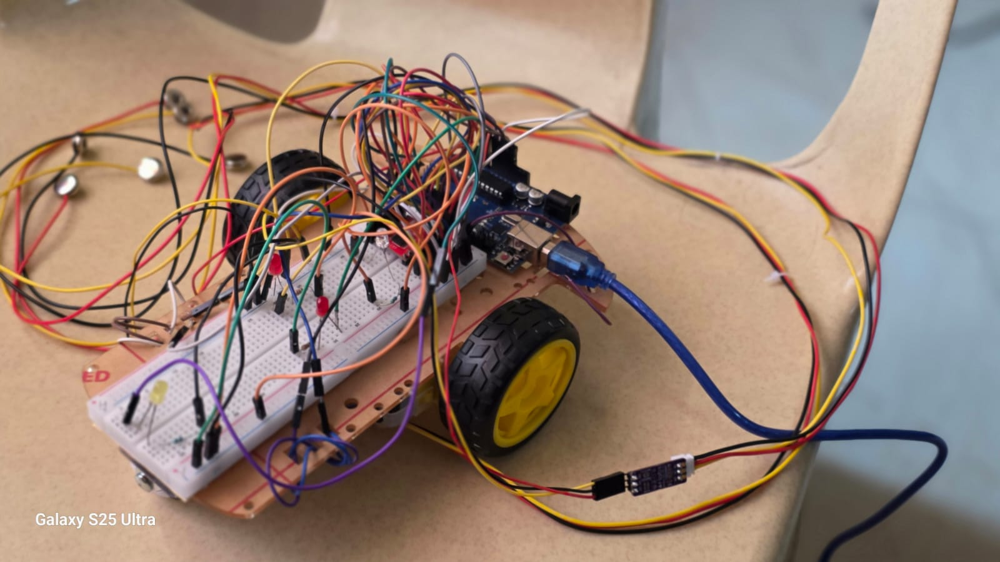
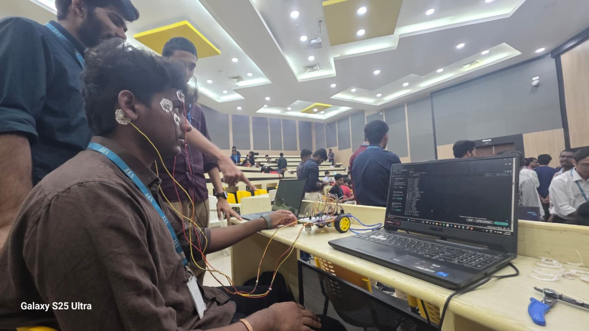
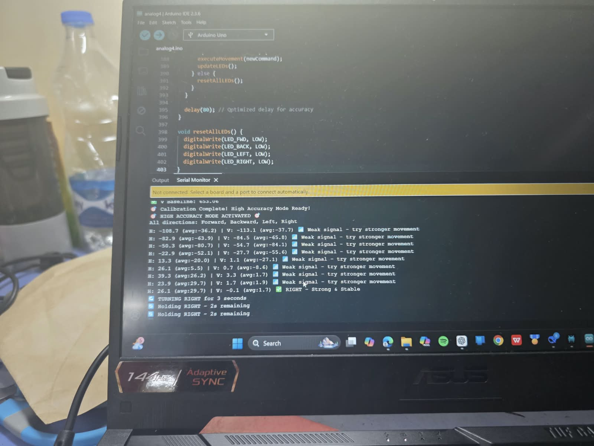
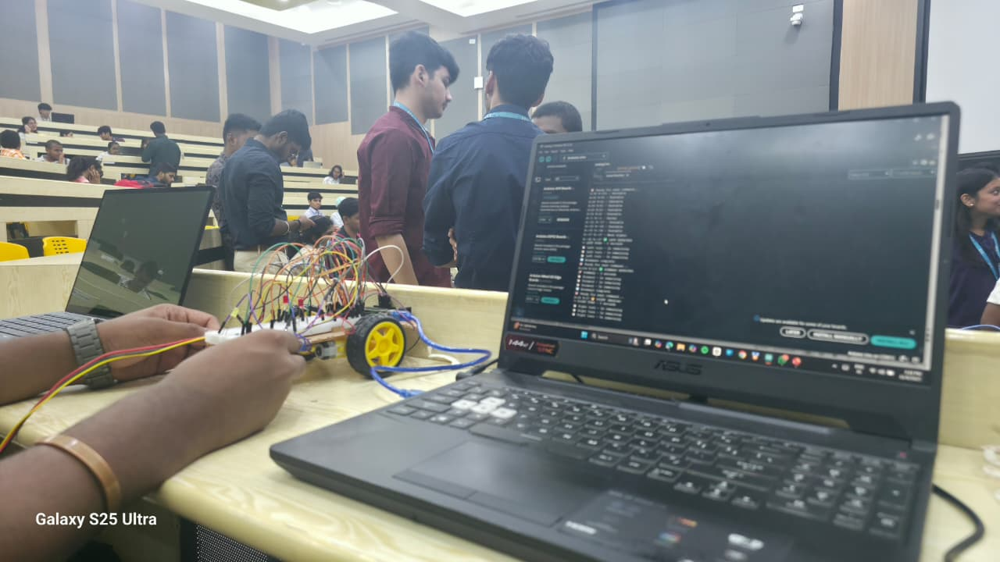

# 🦽 EOG-Based Wheelchair

## Eye-Movement Controlled Assistive Wheelchair Using EOG Signals

The EOG-Based Wheelchair is an assistive mobility prototype that converts eye movements into wheelchair movement commands using Electrooculography (EOG) signals.

The system uses horizontal and vertical EOG signals to detect the user's eye-movement direction. The acquired signals are processed using calibration, filtering, threshold detection, signal-history validation, and direction classification. The detected direction is then converted into a corresponding wheelchair movement command.

---

## 📌 Project Overview

The EOG-Based Wheelchair combines biomedical signal processing, embedded systems, motor control, human-machine interaction, and assistive technology into a single prototype.

The system consists of:

- EOG electrodes for eye-movement signal acquisition
- Horizontal EOG signal for left/right movement detection
- Vertical EOG signal for up/down movement detection
- Baseline calibration
- Moving-average filtering
- Threshold-based movement detection
- Signal-history validation
- Axis-dominance checking
- Direction classification
- Arduino-based wheelchair controller
- Motor driver for wheelchair movement
- DC motors
- Differential-drive wheelchair mechanism
- Serial communication for command monitoring

The detected eye movements are mapped to four wheelchair commands:

- Forward
- Backward
- Left
- Right

---

## ✨ Features

- 👁️ Eye-movement-based wheelchair control
- 📈 Horizontal and vertical EOG signal processing
- ⚙️ Automatic baseline calibration
- 🔄 Moving-average signal filtering
- 🎯 Threshold-based command detection
- 🧠 Signal-history validation
- ↔️ Horizontal eye-movement detection
- ↕️ Vertical eye-movement detection
- 🦽 Four-direction wheelchair movement
- ⚡ Arduino-based real-time control
- 🔧 Differential motor control
- 💻 Serial command monitoring
- 🛡️ Ambiguous movement rejection
- ⏱️ Controlled movement execution
- 🤖 Biomedical human-machine interface
- 🔬 EOG-based assistive mobility

---

## 🔧 Hardware Used

| Component | Quantity | Purpose |
|---|---:|---|
| Arduino Uno | 1 | Main wheelchair controller |
| EOG Electrodes | 4+ | Eye-movement signal acquisition |
| EOG Signal Acquisition Circuit | 2 Channels | Horizontal and vertical EOG |
| Motor Driver | 1 | Motor control |
| DC Motors | 2 | Wheelchair movement |
| Wheelchair Prototype | 1 | Mobility platform |
| Battery / Power Supply | 1 | System power |
| Connecting Wires | - | Electrical connections |

---

## 👁️ EOG Signal Channels

The wheelchair system uses two primary EOG signal axes.

| EOG Signal | Movement Detection |
|---|---|
| Horizontal EOG | Left / Right |
| Vertical EOG | Up / Down |

The horizontal EOG signal is primarily used to detect left and right eye movements.

The vertical EOG signal is primarily used to detect upward and downward eye movements.

The two signal axes are processed to determine the intended wheelchair direction.

---

## 🎯 Eye-Movement to Wheelchair Mapping

The detected eye movements are mapped to the corresponding wheelchair commands.

| Eye Movement | Wheelchair Command |
|---|---|
| Eyes Up | Forward |
| Eyes Down | Backward |
| Eyes Left | Left |
| Eyes Right | Right |

The basic directional mapping is:

Eyes Up → Forward  
Eyes Down → Backward  
Eyes Left → Left  
Eyes Right → Right

This allows the user to control the wheelchair using eye movements instead of a conventional joystick.

---

## ⚙️ System Architecture

The overall wheelchair system follows the sequence:

EOG Electrodes  
↓  
Horizontal & Vertical EOG Signals  
↓  
Signal Acquisition  
↓  
Baseline Calibration  
↓  
Moving-Average Filtering  
↓  
Threshold Detection  
↓  
Signal History Validation  
↓  
Axis Dominance Check  
↓  
Direction Classification  
↓  
Arduino Controller  
↓  
Motor Driver  
↓  
DC Motors  
↓  
Wheelchair Movement

---

## 🔄 Working Principle

### 1. EOG Signal Acquisition

The EOG electrodes acquire electrical potential changes associated with eye movements.

Two main signal components are considered:

- Horizontal EOG
- Vertical EOG

The horizontal channel is used primarily for left and right movement detection, while the vertical channel is used primarily for upward and downward movement detection.

---

### 2. Baseline Calibration

EOG signal values can vary depending on the user, electrode placement, and resting eye position.

Therefore, the system first establishes a baseline reference.

The implemented controller uses:

**Calibration Samples = 50**

The initial samples are used to estimate the resting EOG signal level.

This baseline is then used as the reference for detecting subsequent eye movements.

---

### 3. Signal Difference Calculation

After calibration, the current EOG signal is compared with the established baseline.

Conceptually:

Signal Difference = Current EOG Signal − Baseline EOG Signal

A significant deviation from the baseline indicates a possible eye movement.

---

### 4. Moving-Average Filtering

EOG signals may contain short-term fluctuations and noise.

A moving-average filter is therefore used to smooth the signal before command detection.

The implemented controller uses:

**Moving Average Window = 5 Samples**

The filtering process produces a more stable signal for subsequent threshold detection.

---

### 5. Threshold Detection

The filtered EOG signal is compared with predefined detection thresholds.

The implemented controller uses:

| Parameter | Value |
|---|---:|
| Primary Threshold | 10 |
| Confirmation Threshold | 8 |

The threshold mechanism helps distinguish significant eye movements from smaller signal fluctuations.

---

### 6. Signal History Validation

The controller does not rely on a single EOG sample when deciding whether an intentional movement has occurred.

Previous signal readings are also considered.

The implementation uses:

**Signal History = Previous 3 Readings**

This helps reduce false triggering caused by short-duration signal fluctuations.

---

### 7. Axis Dominance Check

The system checks whether horizontal or vertical movement is dominant.

If horizontal movement is dominant:

Horizontal EOG  
↓  
Left / Right

If vertical movement is dominant:

Vertical EOG  
↓  
Forward / Backward

This helps prevent ambiguous or mixed movements from being incorrectly classified.

---

### 8. Direction Classification

Once the EOG signal passes the required validation conditions, the system determines the eye-movement direction.

Eyes Up → Forward  
Eyes Down → Backward  
Eyes Left → Left  
Eyes Right → Right

The classified direction is then converted into a wheelchair command.

---

### 9. Wheelchair Command Generation

After a valid eye movement has been detected, the corresponding wheelchair command is generated.

The four primary commands are:

- FORWARD
- BACKWARD
- LEFT
- RIGHT

The command is then passed to the motor-control system.

---

### 10. Motor Control

The Arduino controller provides the required control signals to the motor driver.

The motor driver controls the two DC motors of the wheelchair prototype.

The motors are independently controlled to produce:

- Forward movement
- Backward movement
- Left turning
- Right turning
- Stop

---

### 11. Movement Execution

Once a valid command is detected, the wheelchair performs the corresponding movement for a defined period.

The reconstructed controller uses:

**Movement Duration = approximately 3000 ms**

After the movement interval, the system can evaluate the next valid eye-movement command.

---

## 🦽 Differential Drive

The wheelchair prototype uses a two-motor differential-drive configuration.

| Movement | Left Motor | Right Motor |
|---|---|---|
| Forward | Forward | Forward |
| Backward | Reverse | Reverse |
| Left | Reverse | Forward |
| Right | Forward | Reverse |
| Stop | Stop | Stop |

Differential control allows the wheelchair to change direction by independently controlling the two motors.

---

## ⚙️ Wheelchair Movement

### Forward

Both motors rotate in the forward direction.

Left Motor → Forward  
Right Motor → Forward

### Backward

Both motors rotate in the reverse direction.

Left Motor → Reverse  
Right Motor → Reverse

### Left

The motors are driven in opposite directions.

Left Motor → Reverse  
Right Motor → Forward

### Right

The motors are driven in opposite directions.

Left Motor → Forward  
Right Motor → Reverse

---

## 🧠 Command Decision Process

The complete command decision process can be represented as:

EOG Signal  
↓  
Baseline Calibration  
↓  
Signal Difference  
↓  
Moving-Average Filter  
↓  
Threshold Check  
↓  
Signal History Validation  
↓  
Axis Dominance Check  
↓  
Direction Classification  
↓  
Wheelchair Command  
↓  
Motor Control  
↓  
Wheelchair Movement

---

## 🎚️ Signal Calibration

Calibration is an important part of the system because EOG signal levels can vary between users.

The calibration process establishes the user's initial resting EOG signal level.

The implemented controller uses:

**50 Calibration Samples**

The calibrated baseline is then used during the movement-detection stage.

The processing considers:

- Baseline signal
- Signal deviation
- Detection threshold
- Confirmation threshold
- Previous signal readings

---

## 📊 Controller Parameters

The implemented wheelchair controller uses the following parameters:

| Parameter | Value |
|---|---:|
| Calibration Samples | 50 |
| Moving Average Window | 5 |
| Primary Threshold | 10 |
| Confirmation Threshold | 8 |
| Signal History | 3 readings |
| Movement Duration | 3000 ms |

These values are used for the prototype implementation.

---

## 💻 Software Used

### Arduino Controller

The wheelchair controller is developed using:

- Arduino IDE
- Arduino Uno
- Embedded C/C++
- Digital motor-control logic
- Serial communication

The Arduino controller is responsible for interpreting the detected eye-movement direction and controlling the wheelchair motors.

---

## 📡 Serial Communication

Serial communication is used during prototype testing to monitor the detected wheelchair commands.

The serial monitor can display the detected direction and movement information.

For example:

RIGHT

Movement: 3000 ms

This provides a convenient method for verifying the command generated by the control system.

---

## 🔬 Signal Processing Summary

The wheelchair controller performs the following processing stages:

### Baseline Calibration

Establishes the resting EOG signal level.

### Signal Difference

Determines the deviation of the current signal from the baseline.

### Moving-Average Filtering

Reduces short-term signal fluctuations.

### Threshold Detection

Determines whether the signal deviation is sufficiently large.

### History Validation

Uses previous readings to improve command stability.

### Axis Dominance

Determines whether horizontal or vertical movement is dominant.

### Direction Classification

Converts the validated eye movement into a wheelchair command.

---

# 📊 Results

The developed EOG-Based Wheelchair prototype demonstrates an eye-movement-based assistive mobility system.

The prototype demonstrates the complete interaction from eye-movement detection to wheelchair movement.

---

## 🦽 Wheelchair Hardware Prototype

The physical wheelchair prototype integrates the wheelchair platform, DC motors, motor driver, Arduino controller, power supply, wiring, and supporting electronics.

---

## 👁️ EOG Wheelchair Live Demonstration

The prototype demonstrates the EOG electrode setup together with the wheelchair system during operation.

---

## 💻 EOG Serial Right Command

The serial output demonstrates the detection of a RIGHT command from the EOG-based wheelchair control system.

The displayed output provides a visual indication of the detected direction during prototype testing.

---

## 🧪 Wheelchair System Testing

The wheelchair prototype is shown during system testing together with the control electronics and monitoring interface.

---

## 👥 Project Team With Wheelchair Prototype

The project team with the developed EOG-controlled wheelchair prototype.

---

## 📈 Project Outcomes

The developed prototype demonstrates:

- Real-time eye-movement-based control
- Horizontal and vertical EOG signal processing
- Baseline calibration
- Moving-average filtering
- Threshold-based movement detection
- Signal-history validation
- Axis-dominance checking
- Four-direction wheelchair control
- Arduino-based motor control
- Differential-drive movement
- Serial command monitoring
- Assistive human-machine interaction
- Biomedical signal-based mobility control

The project demonstrates the feasibility of using EOG signals as an alternative human-machine interface for an assistive wheelchair prototype.

---

## 🛡️ Signal Validation

EOG signals can contain unwanted variations caused by:

- Baseline drift
- Signal noise
- Small eye movements
- Electrode variation
- Short-duration fluctuations
- Ambiguous eye movements

Therefore, the controller uses multiple processing stages before generating a wheelchair command.

The validation process is:

Calibration  
↓  
Filtering  
↓  
Threshold Detection  
↓  
History Validation  
↓  
Axis Dominance  
↓  
Valid Direction  
↓  
Wheelchair Command

This approach helps reduce accidental command generation.

---

## 📋 Project Results Summary

| Feature | Implementation |
|---|---|
| Input Signal | EOG |
| Signal Channels | Horizontal + Vertical |
| Control Method | Eye Movement |
| Calibration | 50 Samples |
| Filtering | 5-Sample Moving Average |
| Primary Threshold | 10 |
| Confirmation Threshold | 8 |
| History Validation | Previous 3 Readings |
| Commands | Forward / Backward / Left / Right |
| Controller | Arduino Uno |
| Motor Control | Differential Drive |
| Movement Duration | Approximately 3000 ms |
| Application | Assistive Wheelchair |

---

## 🚀 Future Improvements

The wheelchair system can be extended with the following improvements:

- Adaptive EOG threshold adjustment
- User-specific automatic calibration
- Advanced EOG filtering
- Machine-learning-based eye-movement classification
- Deep-learning-based EOG classification
- Blink-based emergency stop
- Obstacle detection
- Ultrasonic obstacle sensors
- LiDAR-based obstacle detection
- Automatic braking
- Maximum speed control
- Battery monitoring
- Motor fault detection
- IMU-based terrain detection
- Terrain-aware wheelchair control
- Closed-loop motor control
- Adaptive motor torque control
- Wireless communication
- Mobile-based monitoring
- Real-time control dashboard
- Improved wheelchair mechanical design
- Improved power management

---

## 🛡️ Safety Improvements

Future versions can incorporate additional safety mechanisms such as:

- Emergency stop
- Emergency blink command
- Obstacle detection
- Automatic braking
- Maximum speed limitation
- Signal-loss detection
- Invalid-command rejection
- Battery monitoring
- Motor fault detection
- Manual override control
- Terrain-aware movement
- User-specific calibration

These features can improve the reliability and safety of future implementations.

---

## 🌍 Applications

The technology can be explored for:

- Assistive wheelchairs
- Eye-controlled mobility systems
- Rehabilitation systems
- Biomedical human-machine interfaces
- Accessibility technology
- Assistive robotics
- Biomedical signal-processing research
- Human-computer interaction
- Smart healthcare systems
- Eye-movement-controlled devices

---

## 🧠 Research Potential

The project provides a foundation for further research in:

- EOG signal classification
- Biomedical signal processing
- Human-machine interfaces
- Assistive robotics
- Intelligent wheelchair control
- Machine-learning-based EOG recognition
- Personalized biomedical interfaces
- Adaptive mobility systems
- Terrain-aware wheelchair control
- Multimodal human-machine interaction

---

## 📁 Project Structure

EOG_Wheelchair_Project/

├── EOG_Wheelchair_Controller_Reconstructed.ino  
│  
├── EOG_Wheelchair_Project_Report.pdf  
│  
├── Images/  
│   ├── eog_serial_right_command.jpeg  
│   ├── eog_wheelchair_live_demo.jpeg  
│   ├── team_with_eog_wheelchair.jpeg  
│   ├── wheelchair_hardware_prototype.jpeg  
│   └── wheelchair_system_testing.jpeg  
│  
└── README.md

---

## 🛠️ Technologies Used

- Arduino Uno
- EOG Electrodes
- EOG Signal Acquisition
- Motor Driver
- DC Motors
- Arduino IDE
- Embedded C/C++
- Serial Communication
- Biomedical Signal Processing
- Human-Machine Interface
- Assistive Technology
- Differential Drive

---

## 📚 Documentation

The complete project documentation is available in:

**EOG_Wheelchair_Project_Report.pdf**

The documentation contains:

- Project overview
- EOG-based wheelchair concept
- Background and methodology
- Hardware implementation
- Software implementation
- EOG signal processing
- Direction detection
- Wheelchair control
- Prototype development
- Testing
- Results
- Future improvements
- References

---

## 🔧 Controller Implementation

The repository contains:

**EOG_Wheelchair_Controller_Reconstructed.ino**

The controller implementation was reconstructed based on the documented project methodology and observed prototype behavior.

It is provided for demonstration, documentation, and further development.

It should not be considered the original source code of the earlier prototype.

---

## ⚠️ Project Limitations

The current prototype has several limitations:

- EOG signals can vary between users.
- Electrode placement can affect signal quality.
- EOG signals can contain noise and baseline drift.
- Fixed thresholds may require adjustment for different users.
- The current controller uses rule-based signal processing.
- Movement duration is predefined.
- Additional safety systems are required for real-world deployment.
- Obstacle detection is not included in the basic controller.
- Further testing is required under different operating conditions.
- The prototype is not a certified medical or mobility device.

---

## 📌 Project Status

The project demonstrates an academic prototype of an EOG-based wheelchair control system.

The repository contains:

- Wheelchair controller implementation
- Project documentation
- Prototype photographs
- Control methodology
- Signal-processing approach
- Prototype results

The system can be further developed toward intelligent and safety-aware wheelchair control.

---

## 🔒 Intellectual Property

The wheelchair project is also associated with an advanced concept involving terrain-adaptive EOG-based intelligent wheelchair control.

Detailed patent/IP documentation is intentionally not included as a public source file in this repository.

Only material intended for project demonstration, academic presentation, documentation, and development is included here.

---

## ⭐ Project Highlights

> An eye-movement-controlled assistive wheelchair that combines EOG signal processing, baseline calibration, directional classification, Arduino-based embedded control, differential motor control, and biomedical human-machine interaction to provide an alternative wheelchair control interface.

---

## 👨‍💻 Project Information

**Project:** EOG-Based Wheelchair Control

**Platform:** Arduino Uno

**Signal:** Electrooculography (EOG)

**Domain:** Biomedical Signal Processing / Embedded Systems / Assistive Technology

**Control Method:** Eye Movement

**Movement:** Forward / Backward / Left / Right

**Application:** Assistive Mobility

---

## 📄 Project Documentation

For complete technical details, implementation methodology, hardware information, experimental results, and references, refer to:

**EOG_Wheelchair_Project_Report.pdf**

---

## 🎯 Conclusion

The EOG-Based Wheelchair project demonstrates how eye movements can be used as a human-machine interface for controlling an assistive mobility platform.

The system combines EOG signal acquisition, baseline calibration, moving-average filtering, threshold detection, signal-history validation, axis-dominance checking, direction classification, Arduino-based control, and differential motor actuation.

The developed prototype demonstrates the feasibility of using eye-movement signals as an alternative method of wheelchair control.

The project provides a foundation for future development involving intelligent EOG classification, adaptive control, obstacle detection, terrain-aware operation, enhanced safety mechanisms, and machine-learning-based human-machine interfaces.

---

## ⭐ Final Project Highlight

> An assistive wheelchair prototype that transforms human eye movements into directional wheelchair commands using Electrooculography, biomedical signal processing, Arduino-based control, and differential motor actuation.
